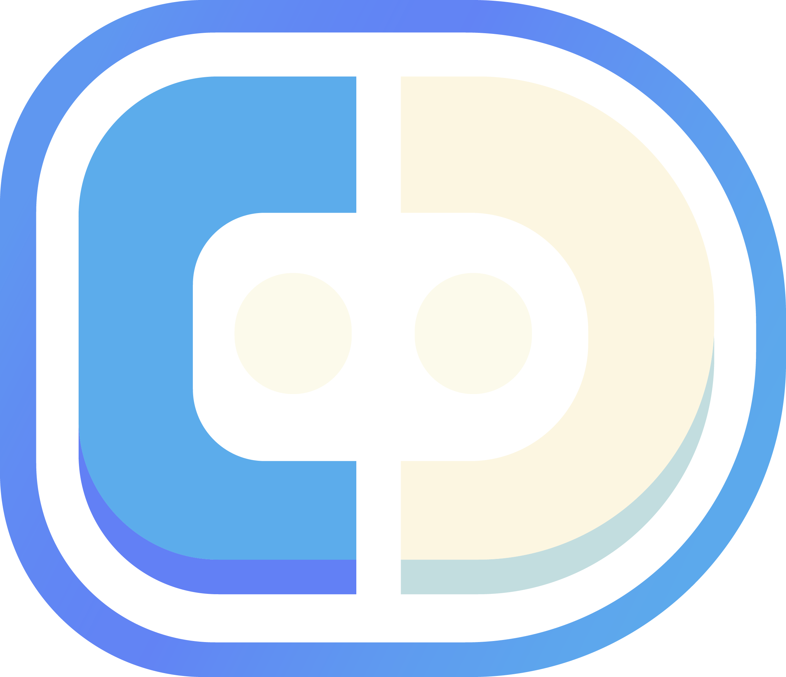

  
#  Discodrome

### Subsonic Compatible Discord Music Bot

A discord music bot that seamlessly streams music from your personal music server directly to your voice channels. Works great with Navidrome, and other subsonic compatible music servers.

---

## 🎮 Commands

| Command | Description |
|---------|-------------|
| `/play` | Plays a specified track |
| `/disco` | Plays an artist's entire discography |
| `/queue` | View the current queue |
| `/clear` | Clear the current queue |
| `/shuffle` | Shuffles the current queue |
| `/skip` | Skip the current track |
| `/stop` | Stop playing the current track |
| `/autoplay` | Toggles autoplay |

## 🚀 Complete Setup Guide

### Step 1: Create a Discord Bot

1. Go to the [Discord Developer Portal](https://discord.com/developers/applications)
2. Click "New Application" and give it a name
3. Navigate to the "Bot" tab and click "Add Bot"
4. Under the TOKEN section, click "Reset Token" and copy your new token
5. Enable the following Privileged Gateway Intents:
   - `MESSAGE CONTENT INTENT`
   - `SERVER MEMBERS INTENT`
   - `PRESENCE INTENT`
6. Navigate to "OAuth2" → "URL Generator"
7. Select the following scopes:
   - `bot`
   - `applications.commands`
8. Select bot permissions: 
  - `Send Messages`
  - `Connect`
  - `Speak`
  - `Use Voice Activity`
  - `Read Message History`
9. Copy the generated URL and paste it in your browser to invite the bot to your server

### Step 2: Set Up Your Environment

#### Required Information:
- **Discord Bot Token**: From step 1
- **Discord Server ID**: Right-click your server icon → "Copy ID" (Developer Mode must be enabled in Discord settings)
- **Your Discord User ID**: Right-click your username → "Copy ID"
- **Subsonic Server Details**: URL, username, and password for your music server

### Step 3: Deploy with Docker

1. Pull the Docker image:
`docker pull 7eventy7/discodrome:latest`

2. Run the container with the required environment variables from the configuration section below:

## ⚙️ Configuration Options

### Environment Variables

| Variable | Description | Required |
|----------|-------------|----------|
| `SUBSONIC_SERVER` | URL of your Subsonic server (include http/https) | Yes |
| `SUBSONIC_USER` | Username for your Subsonic server | Yes |
| `SUBSONIC_PASSWORD` | Password for your Subsonic server | Yes |
| `DISCORD_BOT_TOKEN` | Your Discord bot token | Yes |
| `DISCORD_TEST_GUILD` | Discord server ID where commands will be registered | Yes |
| `DISCORD_OWNER_ID` | Your Discord user ID | Yes |
| `BOT_STATUS` | Custom status message for the bot | No |

### Supported Subsonic Servers

- Navidrome
- Airsonic
- Subsonic
- Gonic
- Ampache (with Subsonic API enabled)
- Jellyfin (with Subsonic plugin)

## 🛠️ Technical Stack

- Discord.js v14
- Node.js
- Subsonic API
- Docker
- FFmpeg for audio processing

## 👥 Contributing

We welcome contributions! Whether it's:
- 🐛 Reporting bugs
- 💡 Suggesting features
- 📝 Improving documentation
- 🔍 Submitting fixes
- ✨ Adding new features

Please check our [GitHub Issues](https://github.com/7eventy7/discodrome/issues) before submitting new ones.

## 📝 License

GPL-3.0 license - feel free to use this project for most any purpose.

## 🙏 Acknowledgments

This project is a fork of [Submeister](https://github.com/Gimzie/submeister) by Gimzie. We've built upon their excellent foundation to add new features and improvements while maintaining the core functionality that made the original project great.

---

Forked with ❤️ by <a href="https://github.com/7eventy7">7eventy7</a>

